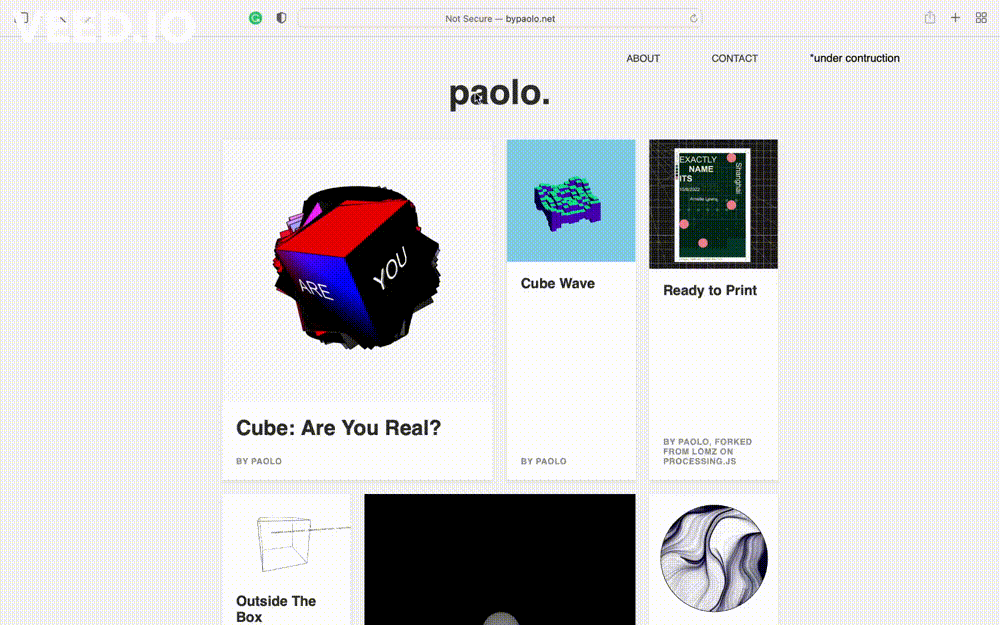

# [bypaolo.net](https://bypaolo.net)

   

---

This personal project showcases my coded art in a fully responsive online exhibit, where each artwork is interactive and engaging. Many of these pieces are inspired by the innovative creators on [p5.js](https://p5js.org) and [openprocessing.com](https://openprocessing.com), reflecting a blend of creativity and technology.

---

I invite you to explore the exhibit, interact with the artworks, and immerse yourself in this digital art collection. Feel free to [file issues](https://github.com/paolopedroso/online-art-exhibit/issues) or send feedback to **paoloapedroso@gmail.com**. Thank you for visiting!
